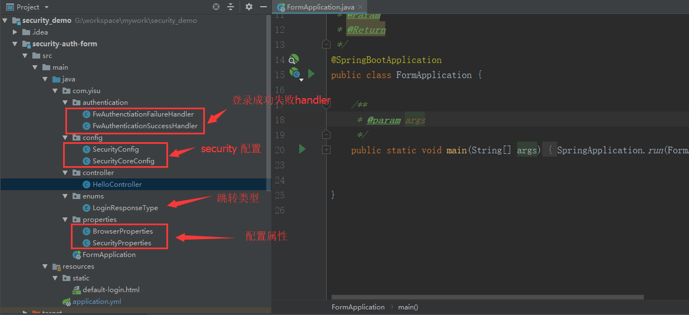
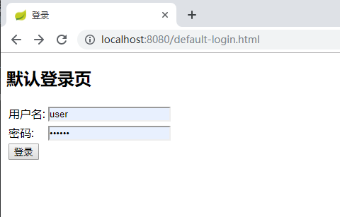

 ### 本节主要是默认的security自定义登录和返回错误信息
 
##1.项目结构

##2.介绍
###2.1 项目启动
浏览器输入`http://localhost:8080` 会重定向到`http://localhost:8080/authentication/require`
根据`fw.security.browser.loginType`判断，JSON 会显示`{"code":500,"msg":"访问的服务需要身份认证，请重新登录","data":null,"meta":null}`
REDIRECT 会重定向到`fw.security.browser.loginPage`  设置的页面

###2.2 登录

用户名配置在`application.yml`中，用户名密码是`user/123456`

登录成功之后会返回用户登录的信息，密码被SpringSecurity处理为空
####登录成功的处理
```java
@Override
	public void onAuthenticationSuccess(HttpServletRequest request, HttpServletResponse response,
                                        Authentication authentication) throws IOException, ServletException {

		log.info("登录成功");
        //JSON类型，会直接返回认证信息，否则执行SpringSecurity默认的跳转
		if (LoginResponseType.JSON.equals(securityProperties.getBrowser().getLoginType())) {
			response.setContentType("application/json;charset=UTF-8");
			response.getWriter().write(objectMapper.writeValueAsString(authentication));
		} else {
			super.onAuthenticationSuccess(request, response, authentication);
		}

	}
```
###2.3 接口
访问业务接口 `http://localhost:8080/user` ,只有用户登录成功之后才能访问。

##3 SpringSecurity 配置
```java
@Override
    protected void configure(HttpSecurity http) throws Exception {
        http.formLogin()
                .loginPage("/authentication/require")
                .loginProcessingUrl("/authentication/form")
                .successHandler(fwAuthenticationSuccessHandler)
                .failureHandler(fwAuthenctiationFailureHandler)
                .and()
                .authorizeRequests()
                .antMatchers("/authentication/require",
                        securityProperties.getBrowser().getLoginPage()).permitAll()
                .anyRequest().authenticated()
                .and()
                .csrf().disable();
    }
```
