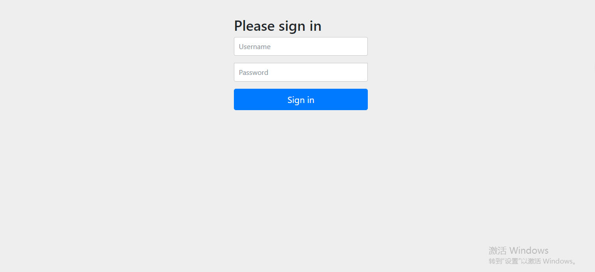
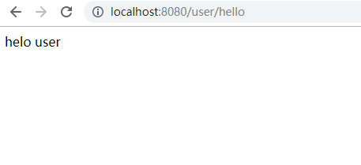
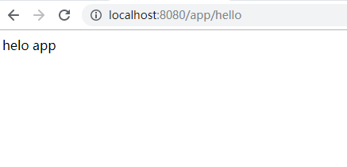
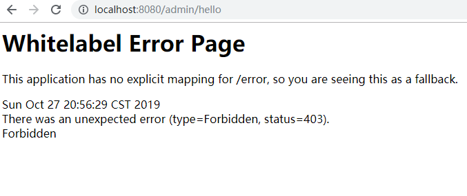

 ### 本节主要是默认的security登录
 https://localhost:8080/admin/hello
 https://localhost:8080/user/hello
 https://localhost:8080/api/hello
 
#引入的依赖如下
``` pom
<dependencies>
        <dependency>
            <groupId>org.springframework.boot</groupId>
            <artifactId>spring-boot-starter</artifactId>
        </dependency>
        <dependency>
            <groupId>org.springframework.boot</groupId>
            <artifactId>spring-boot-starter-web</artifactId>
        </dependency>
        <dependency>
            <groupId>org.springframework.boot</groupId>
            <artifactId>spring-boot-starter-security</artifactId>
        </dependency>

        <dependency>
            <groupId>org.springframework.boot</groupId>
            <artifactId>spring-boot-starter-test</artifactId>
            <scope>test</scope>
        </dependency>
    </dependencies>  
```

#编写controller
```java

@RestController
@RequestMapping("admin")
public class AdminController {
    @RequestMapping("/hello")
    public String index() {
        return "helo admin";
    }
}

@RestController
@RequestMapping("app")
public class AppController {
    @RequestMapping("/hello")
    public String index() {
        return "helo app";
    }

}

@RestController
@RequestMapping("user")
public class UserController {
    @RequestMapping("/hello")
    public String index() {
        return "helo user";
    }

}
```
#添加config配置
```java
@EnableWebSecurity
public class SecurityConfig extends WebSecurityConfigurerAdapter {
    @Override
    protected void configure(HttpSecurity http) throws Exception {
        http.authorizeRequests()
                .antMatchers("/admin/**").hasRole("ADMIN")
                .antMatchers("/user/**").hasRole("USER")
                .antMatchers("/app/**").permitAll()
                .anyRequest().authenticated()
                .and()
                .formLogin();
    }

    //再内存中模拟创建账号和角色
    @Bean
    @Override
    public UserDetailsService userDetailsServiceBean() throws Exception {
        InMemoryUserDetailsManager manager = new InMemoryUserDetailsManager();
        manager.createUser(User.withUsername("user").password("123").roles("USER").build());
        manager.createUser(User.withUsername("admin").password("123").roles("USER", "ADMIN").build());
        return manager;
    }
    //支持没有加密方式的方法
    @Bean
    public static NoOpPasswordEncoder passwordEncoder() {
        return (NoOpPasswordEncoder) NoOpPasswordEncoder.getInstance();
    }
}
```
#启动之后输入 localhost:8080


#用户名密码
输入的用户名密码是上文写死的 `user 123` 和`admin 123`
user用户的话可以看到 api/hello 和 user/hello 的数据，看不到admin/hello的数据




如果想看到admin的接口信息，需要用admin的用户登录

