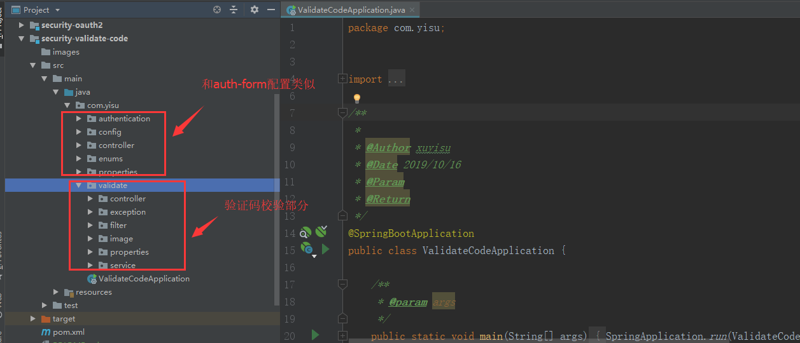
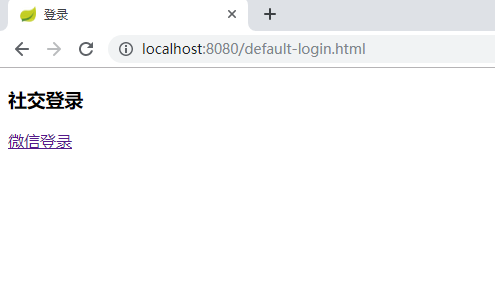
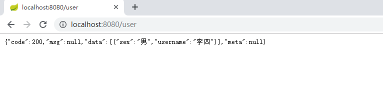

 ### 本节主要是默认的security wechat登录
 
##1.项目结构

##2.介绍
###2.1 项目启动（功能部分和security-auth-form类似）
浏览器输入`http://localhost:8080` 会重定向到`http://localhost:8080/authentication/require`
根据`fw.security.browser.loginType`判断，JSON 会显示`{"code":500,"msg":"访问的服务需要身份认证，请重新登录","data":null,"meta":null}`
REDIRECT 会重定向到`fw.security.browser.loginPage`  设置的页面

###2.2 登录
添加了验证码的显示和校验

 

登录成功之后会返回用户登录的信息，密码被SpringSecurity处理为空
####2.3 登录成功的处理

```java
@Override
    protected void configure(HttpSecurity http) throws Exception {

        http.apply(fwSocialSecurityConfig)
                .and()
                .rememberMe()
                .tokenRepository(persistentTokenRepository())
                .tokenValiditySeconds(securityProperties.getBrowser().getRememberMeSeconds())
                .userDetailsService(userDetailsService)
                .and()
                .sessionManagement()
                .invalidSessionStrategy(invalidSessionStrategy)
                .maximumSessions(securityProperties.getBrowser().getSession().getMaximumSessions())
                .maxSessionsPreventsLogin(securityProperties.getBrowser().getSession().isMaxSessionsPreventsLogin())
                .expiredSessionStrategy(sessionInformationExpiredStrategy)
                .and()
                .and()
                .authorizeRequests()
                .antMatchers(
                        FwCommonConstants.DEFAULT_UNAUTHENTICATION_URL,
                        FwCommonConstants.DEFAULT_LOGIN_PROCESSING_URL_MOBILE,
                        securityProperties.getBrowser().getLoginPage(),
                        FwCommonConstants.DEFAULT_VALIDATE_CODE_URL_PREFIX+"/*",
                        securityProperties.getBrowser().getSession().getSessionInvalidUrl()+".json",
                        securityProperties.getBrowser().getSession().getSessionInvalidUrl()+".html"
                        )
                .permitAll()
                .anyRequest()
                .authenticated()
                .and()
                .csrf().disable();
    }
```
###2.4 微信的配置
需要到`https://open.weixin.qq.com/`进行注册，现在只能企业注册
```yml
fw:
  security:
    browser:
      loginPage: /default-login.html  #默认登录页面地址  loginType为REDIRECT时起作用
      loginType: JSON  #两种  REDIRECT  重定向页面 ，JSON 返回json描述
    social:
      qq:
        app-id:
        app-secret:
      filterProcessesUrl: /qqLogin  #默认auth
```
###2.4 微信的代码配置
在包com.yisu.social下面 \
注意在springboot2.* 已经将`SocialProperties、SocialWebAutoConfiguration、SocialAutoConfigurerAdapter` 已经将其从源码中去除，需要自己实现

###2.5 绑定和解绑
绑定 `/connect/weixin(provide_id)  method:post`  \
解绑 `/connect/weixin(provide_id)  method:delete`
###2.6 接口
访问业务接口 `http://localhost:8080/user` ,只有用户登录成功之后才能访问。

`authentication/form` 是SpringSecurity默认的表单的登录接口
