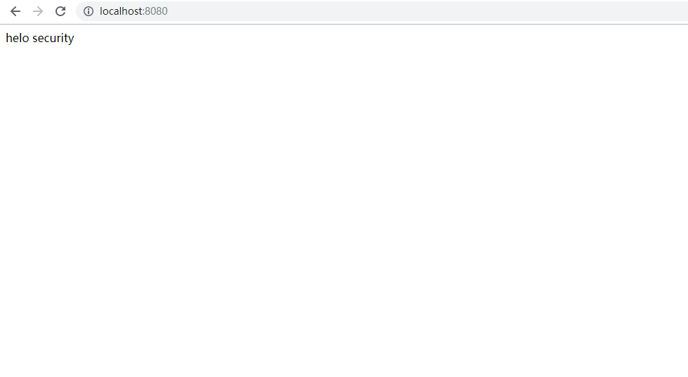

 ### 本节主要是默认的security登录
 https://localhost:8080
 
#引入的依赖如下
``` pom
<dependencies>
        <dependency>
            <groupId>org.springframework.boot</groupId>
            <artifactId>spring-boot-starter</artifactId>
        </dependency>
        <dependency>
            <groupId>org.springframework.boot</groupId>
            <artifactId>spring-boot-starter-web</artifactId>
        </dependency>
        <dependency>
            <groupId>org.springframework.boot</groupId>
            <artifactId>spring-boot-starter-security</artifactId>
        </dependency>

        <dependency>
            <groupId>org.springframework.boot</groupId>
            <artifactId>spring-boot-starter-test</artifactId>
            <scope>test</scope>
        </dependency>
    </dependencies>  
```

#编写controller
```java
@Controller
public class HelloController {
    @RequestMapping("/")
    public String index() {
        return "helo security";
    }
}

```
#启动之后输入 localhost:8080

输入默认的用户名`user` 密码(每次随机生成)在控制台查询即可跳转
```log
2019-10-27 13:19:19.077  INFO 388 --- [           main] o.s.s.concurrent.ThreadPoolTaskExecutor  : Initializing ExecutorService 'applicationTaskExecutor'
2019-10-27 13:19:19.491  INFO 388 --- [           main] .s.s.UserDetailsServiceAutoConfiguration : 

Using generated security password: 9cfc2e67-d1d1-41eb-83d7-ed3035913be7

2019-10-27 13:19:19.692  INFO 388 --- [           main] o.s.s.web.DefaultSecurityFilterChain     : Creating filter chain: any request, [org.springframework.security.web.context.request.async.WebAsyncManagerIntegrationFilter@6cd64b3f, org.springframework.security.web.context.SecurityContextPersistenceFilter@4fe64d23, org.springframework.security.web.header.HeaderWriterFilter@37b56ac7, org.springframework.security.web.csrf.CsrfFilter@1bb15351, org.springframework.security.web.authentication.logout.LogoutFilter@370c1968, org.springframework.security.web.authentication.UsernamePasswordAuthenticationFilter@490c7a83, org.springframework.security.web.authentication.ui.DefaultLoginPageGeneratingFilter@106d77da, org.springframework.security.web.authentication.ui.DefaultLogoutPageGeneratingFilter@51b01550, org.springframework.security.web.authentication.www.BasicAuthenticationFilter@4779aae6, org.springframework.security.web.savedrequest.RequestCacheAwareFilter@6af5bbd0, org.springframework.security.web.servletapi.SecurityContextHolderAwareRequestFilter@5a50d9fc, org.springframework.security.web.authentication.AnonymousAuthenticationFilter@2ef0dd86, org.springframework.security.web.session.SessionManagementFilter@35a0e495, org.springframework.security.web.access.ExceptionTranslationFilter@1b7332a7, org.springframework.security.web.access.intercept.FilterSecurityInterceptor@1cdc1bbc]
2019-10-27 13:19:19.836  INFO 388 --- [           main] o.s.b.w.embedded.tomcat.TomcatWebServer  : Tomcat started on port(s): 8080 (http) with context path ''
2019-10-27 13:19:19.844  INFO 388 --- [           main] com.yisu.DemoApplication                 : Started DemoApplication in 5.158 seconds (JVM running for 8.942)

```
#成功之后

#可以通过配置修改用户名密码
```yml
#本节说的是springboot的默认配置
server:
  port: 8080  #应用端口号
logging:
  com.yisu: debug #日志级别
spring:
  security:
    user:
      name: user  #自定义这是用户名，如果没设置 默认的用户名是user
      password: 123456 #自定义密码，如果没设置 默认的密码在控制台中寻找

```
这样下次登录用自定义的账号密码即可
