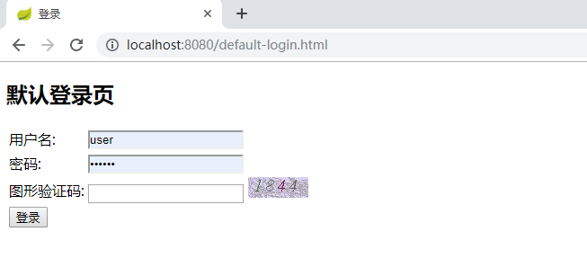

 ### 本节主要是默认的security验证码处理
 
##1.项目结构

##2.介绍
###2.1 项目启动（功能部分和security-auth-form类似）
浏览器输入`http://localhost:8080` 会重定向到`http://localhost:8080/authentication/require`
根据`fw.security.browser.loginType`判断，JSON 会显示`{"code":500,"msg":"访问的服务需要身份认证，请重新登录","data":null,"meta":null}`
REDIRECT 会重定向到`fw.security.browser.loginPage`  设置的页面

###2.2 登录
添加了验证码的显示和校验

用户名配置在`application.yml`中，用户名密码是`user/123456`

登录成功之后会返回用户登录的信息，密码被SpringSecurity处理为空
####2.3 登录成功的处理
这里需要将校验的逻辑设置在UsernamePasswordAuthenticationFilter之前
```java
@Override
    protected void configure(HttpSecurity http) throws Exception {
        ValidateCodeFilter validateCodeFilter=new ValidateCodeFilter();
        validateCodeFilter.setAuthenticationFailureHandler(fwAuthenctiationFailureHandler);

        http.addFilterBefore(validateCodeFilter, UsernamePasswordAuthenticationFilter.class)
                .formLogin()
                .loginPage("/authentication/require")
                .loginProcessingUrl("/authentication/form")
                .successHandler(fwAuthenticationSuccessHandler)
                .failureHandler(fwAuthenctiationFailureHandler)
                .and()
                .authorizeRequests()
                .antMatchers("/authentication/require",
                        securityProperties.getBrowser().getLoginPage(),
                        "/code/image").permitAll()
                .anyRequest().authenticated()
                .and()
                .csrf().disable();
    }
```
###2.4 验证码的配置
@ConditionalOnMissingBean(name = "imageValidateCodeGenerator")主要是为了方便后续拓展，如果已经注册了imageValidateCodeGenerator的bean,就不会使用当前默认的注册
```java
@Configuration
public class ValidateCodeBeanConfig {

	@Autowired
	private SecurityProperties securityProperties;

	@Bean
	@ConditionalOnMissingBean(name = "imageValidateCodeGenerator")
	public ValidateCodeGenerator imageValidateCodeGenerator() {
		ImageCodeGenerator codeGenerator = new ImageCodeGenerator();
		codeGenerator.setSecurityProperties(securityProperties);
		return codeGenerator;
	}


}
```
###2.5 验证码的过滤处理

    1.在请求`localhost:8080/code/image`请求之后验证码的code就会设置到session缓存中
    2.验证码的过滤处理需要继承`OncePerRequestFilter`的处理，它能够确保在一次请求只通过一次filter，而不需要重复执行
    3.验证码的过滤器需要对`/authentication/form`进行拦截
###2.6 拦截器的执行顺序和范围如下图，从里往外是执行顺序

    
    1.过滤器可以获取请求的地址信息
    2.拦截器可以获取执行的方法和类
    3.切面可以获取方法里的参数和变量
###2.7 拦截器的校验方案
```java
ImageCode codeInSession = (ImageCode) sessionStrategy.getAttribute(request, SESSION_KEY);

		String codeInRequest;
		try {
			codeInRequest = ServletRequestUtils.getStringParameter(request.getRequest(),
					"imageCode");
		} catch (ServletRequestBindingException e) {
			throw new ValidateCodeException("获取验证码的值失败");
		}

		if (StringUtils.isBlank(codeInRequest)) {
			throw new ValidateCodeException("验证码的值不能为空");
		}

		if (codeInSession == null) {
			throw new ValidateCodeException("验证码不存在");
		}

		if (codeInSession.isExpried()) {
			sessionStrategy.removeAttribute(request, SESSION_KEY);
			throw new ValidateCodeException("验证码已过期");
		}

		if (!StringUtils.equals(codeInSession.getCode(), codeInRequest)) {
			throw new ValidateCodeException("验证码不匹配");
		}

		sessionStrategy.removeAttribute(request, SESSION_KEY);
```
###2.8 接口
访问业务接口 `http://localhost:8080/user` ,只有用户登录成功之后才能访问。

`authentication/form` 是SpringSecurity默认的表单的登录接口
