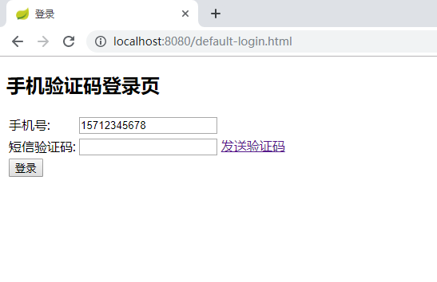

 ### 本节主要是默认的security短信验证码处理
 
##1.项目结构

##2.介绍
###2.1 项目启动（功能部分和security-auth-form类似）
浏览器输入`http://localhost:8080` 会重定向到`http://localhost:8080/authentication/require`
根据`fw.security.browser.loginType`判断，JSON 会显示`{"code":500,"msg":"访问的服务需要身份认证，请重新登录","data":null,"meta":null}`
REDIRECT 会重定向到`fw.security.browser.loginPage`  设置的页面

###2.2 登录
添加了验证码的显示和校验

 点击发送验证码，在控制台可以看到模拟发送的验证码`向手机15712345678发送短信验证码701262` \
 用户名配置在`application.yml`中，用户名密码是`user/123456`

登录成功之后会返回用户登录的信息，密码被SpringSecurity处理为空
####2.3 登录成功的处理(已经将之前的表单登录和校验封装在此表单中)
这里需要将验证码登录添加到AuthenticationManager里面
```java
@Override
    protected void configure(HttpSecurity http) throws Exception {
        //密码登录配置    
        applyPasswordAuthenticationConfig(http);

        http.apply(validateCodeSecurityConfig)//短信验证码校验
                .and()
                .apply(smsCodeAuthenticationSecurityConfig)//短信登录
                .and()
                .rememberMe()//记住我功能
                .tokenRepository(persistentTokenRepository())//登录成功的token记录到数据库
                .tokenValiditySeconds(securityProperties.getBrowser().getRememberMeSeconds())
                .userDetailsService(userDetailsService)
                .and()
                .sessionManagement()//session管理
                .invalidSessionStrategy(invalidSessionStrategy)
                .maximumSessions(securityProperties.getBrowser().getSession().getMaximumSessions())
                .maxSessionsPreventsLogin(securityProperties.getBrowser().getSession().isMaxSessionsPreventsLogin())
                .expiredSessionStrategy(sessionInformationExpiredStrategy)
                .and()
                .and()
                .authorizeRequests()
                .antMatchers(//设置不拦截的路径
                        FwCommonConstants.DEFAULT_UNAUTHENTICATION_URL,
                        FwCommonConstants.DEFAULT_LOGIN_PROCESSING_URL_MOBILE,
                        securityProperties.getBrowser().getLoginPage(),
                        FwCommonConstants.DEFAULT_VALIDATE_CODE_URL_PREFIX+"/*",
                        securityProperties.getBrowser().getSession().getSessionInvalidUrl()+".json",
                        securityProperties.getBrowser().getSession().getSessionInvalidUrl()+".html"
                        )
                .permitAll()
                .anyRequest()
                .authenticated()
                .and()
                .csrf().disable();//处理跨域问题
    }
```
###2.4 验证码的配置
@ConditionalOnMissingBean(SmsCodeSender.class)主要是为了方便后续拓展，如果已经注册了SmsCodeSender的bean,就不会使用当前默认的注册
```java
@Configuration
public class ValidateCodeBeanConfig {

	    @Bean
    	@ConditionalOnMissingBean(SmsCodeSender.class)
    	public SmsCodeSender smsCodeSender() {
    		return new DefaultSmsCodeSender();
    	}


}
```
###2.5 验证码的过滤处理

    1.在请求`localhost:8080/code/sms`请求之后验证码的code就会设置到session缓存中
    2.验证码的过滤处理需要继承`OncePerRequestFilter`的处理，它能够确保在一次请求只通过一次filter，而不需要重复执行
    3.验证码的过滤器需要对`/authentication/mobile`进行拦截
###2.6 拦截器的执行顺序和范围如下图，从里往外是执行顺序

    
    1.过滤器可以获取请求的地址信息
    2.拦截器可以获取执行的方法和类
    3.切面可以获取方法里的参数和变量
###2.7 拦截器的校验方案
```java
        ValidateCodeType processorType = getValidateCodeType(request);
		String sessionKey = getSessionKey(request);

		C codeInSession = (C) sessionStrategy.getAttribute(request, sessionKey);

		String codeInRequest;
		try {
			codeInRequest = ServletRequestUtils.getStringParameter(request.getRequest(),
					processorType.getParamNameOnValidate());
		} catch (ServletRequestBindingException e) {
			throw new ValidateCodeException("获取验证码的值失败");
		}

		if (StringUtils.isBlank(codeInRequest)) {
			throw new ValidateCodeException(processorType + "验证码的值不能为空");
		}

		if (codeInSession == null) {
			throw new ValidateCodeException(processorType + "验证码不存在");
		}

		if (codeInSession.isExpried()) {
			sessionStrategy.removeAttribute(request, sessionKey);
			throw new ValidateCodeException(processorType + "验证码已过期");
		}

		if (!StringUtils.equals(codeInSession.getCode(), codeInRequest)) {
			throw new ValidateCodeException(processorType + "验证码不匹配");
		}

		sessionStrategy.removeAttribute(request, sessionKey);
```
###2.8 接口
访问业务接口 `http://localhost:8080/user` ,只有用户登录成功之后才能访问。

`authentication/form` 是SpringSecurity默认的表单的登录接口
